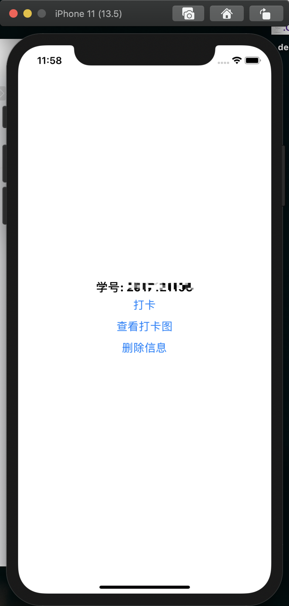
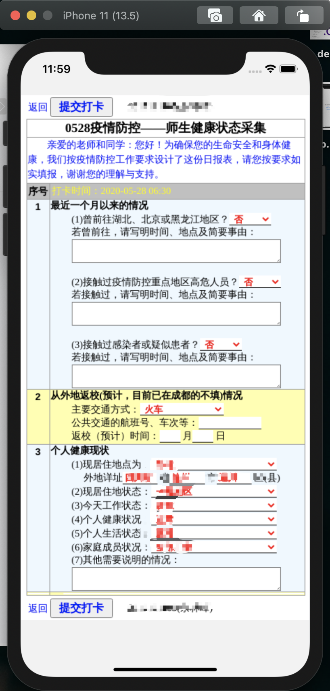

# 打卡啦 DaKaLa

## 介绍

> 成都信息工程大学疫情打卡解决器

每天重复的工作很快会燃烧自己对生活的热情，本项目旨在帮兄弟萌燃起对生活的热情2333

### 可clone 至本地部署

+ 入口文件为 app.py
+ 附带 Dockerfile 和 build.sh 构建脚本，可build docker镜像进行容器部署

## 本机运行

1. 前提: 需要 selenium chrome-driver
2. 前提: 需要 chrome
3. 前提: 安装必要依赖 文件夹内运行 `pip install -r requirements.txt`
4. 启动: `python3 app.py`
5. 访问 localhost:5000 即可

## Docker 部署

1. 前提: docker环境 (包括 docker, docker-compose)
2. 运行： base_image 文件夹下运行base_build.sh脚本 构建基本镜像
3. 运行: 主文件夹下运行`sh build.sh` 等待镜像构建完成
4. 运行: `docker-compose up -d` (可自行修改docker-compose.yml 文件自定义)
  
## 移动端

<b> 编译好的app在 `mobile-app` 文件夹中，请自取 </b>

- ios 端由于我没有开发者账号，所以需要借助 <b> altsotre </b> 或者  <b> impactor </b> 安装，具体使用请百度

基于React Native开发的移动端，代码很烂，但基本功能已实现。可自行构建移动端应用

- [移动端项目地址](https://github.com/yulinfeng000/DaKaLa-mobile)
- [app下载地址](https://github.com/yulinfeng000/DaKaLa/releases)

#### 声明 移动端没有实机测试，目前稳定性，适配度未知

